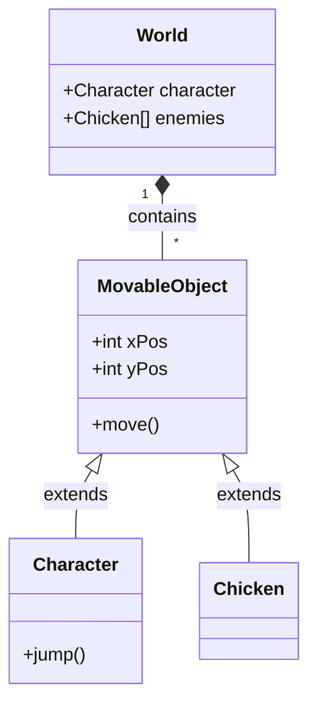

```mermaid
classDiagram
    class World {
        +Character character
        +Chicken[] enemies
    }

    class MovableObject {
        +int xPos
        +int yPos
        +move()
    }

    class Character {
        +jump()
    }

    class Chicken {
    }

    World "1" *-- "*" MovableObject : contains
    MovableObject <|-- Character : extends
    MovableObject <|-- Chicken : extends
```
